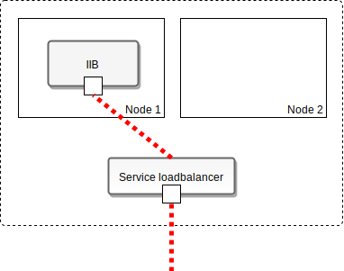

IIB on IBM Cloud Private Demo
=============================

The following scenarios are covered:

1. IIB auto-scaling and load balancing (stateless case)
2. IIB high-availability (readiness/liveness probes)
3. MQ integration
4. IIB Global Cache
5. Custom catalog item (HELM chart)
6. Automated deployment of IIB flows (BAR files) across the cluster
7. IIB version rolling update (using k8s rolling update features)
8. Centralized IIB logging (show centralized IIB logs in Kiabana)
9. (?) IIB Monitoring
10. (?) A/B testing, canaries, network policies
11. (?) ISTIO - pod-to-pod TLS

## Autoscaling with load balancer

**Scenario**:  
Illustrate how IIB nodes can be automatically scaled for increased performance and resilience based on pre-defined thresholds.

**Benefits:**

- Automated dynamic scaling of IIB based on load
- IIB high-availability due to redundancy and auto-recovery

**Tasks**

- Prepare a sample IIB flow (*BAR file*) to respond to GET requests on a REST interface
- Setup basic IIB stateless scalable *deployment* 
- Setup kubernetes auto-scaling policy based on CPU usage
- Simulate increased load to trigger auto-scaling

**Implementation**

Scalable IIB deployment is configured with cluster-wide NFS persistent volume (`/export/BARs`) which holds BARs files. Auto-scaling is set based on CPU threshold (20%). Initial deployment starts one IIB instance and scales to two instances on high load. 

Create auto-scaling policy:

     kubectl autoscale deployment --max=2 --min=1 --cpu-percent=20 ibm-integration-bus-demo

The test scenario involves high volume injections of REST GET queries to the service until automatic instance scale-up gets triggered.

HTTP GET single test:

	curl -s 192.168.24.33:32420/icpIIBtest

HTTP GET smoke test:

	curl -s 192.168.24.33:32420/icpIIBtest?[1-1000000] > /dev/null
    ... repeat for parallel TCP sessions

or better using the stress load script (which runs 100 parallel TCP connections)
    
    ./iib_stress_test.py

Monitor pods load in ICP
	
	watch -n 1 kubectl top pod -l app=ibm-integration-bus-prod -n default

Monitor message stats in iib instances

    kubectl port-forward <iib pod 1> 5000:4414
    kubectl port-forward <iib pod 2> 5001:4414

    and then from browser host:
    ssh -L 5000:localhost:5000 -L 5001:localhost:5001 master
    point browser to http://localhost:5000 and 5001

## High availability

**Scenario**  
Constantly watch the IIB node instances and recover from from accidental crashes. Suppress IIB nodes that are running but slow to respond to requests

**Benefits:**

- Increased availability (lower downtime) due to automatic recovery and re-scheduling. Typically useful for low-level failures (HW, resources, network, etc.)
- Visibility and monitoring

**Tasks**

- Setup Readiness probe
- Setup Liveness probe
- Simulate failure or unavailability

**Implementation**

IIB high availability is configured using the pod Readiness and Liveness probes which check the IIB HTTP endpoint (exposed on TCP port 7800).

The test case involves blocking the port temporarily on one IIB pod instance and observing how kubernetes a) initially re-routes the incoming traffic and b) later restarts the pod.

Stop IIB node without killing pod

    kubectl exec <iib pod name> -ti -- /opt/ibm/iib-10.0.0.10/server/bin/mqsistop IIB_NODE

<!-- Block incoming port using IPtables:

    kubectl exec <iib pod> -- /sbin/iptables -A INPUT -p tcp --destination-port 7800 -j DROP -->

Watch pod events

    watch "kubectl describe pods ibm-integration-bus-prod-686b58999d-fvdjq | tail"

Watch iib pods

    watch kubectl get pods -o wide -l app=ibm-integration-bus-prod

## MQ Integration

IIB production image doesn't have MQ libraries at the moment. So to demo MQ workflow within IIB container we used development image https://github.com/DAVEXACOM/IIB-MQ.git and connect it to MSB pipeline. In order to deploy another MQ workflow replace/add .bar file to the project.

**Dockerfile modification**
In order to minimize build time move line
	
	COPY *.bar  /etc/mqm/

after following lines

	# Expose default admin port and http port, plus MQ ports
	EXPOSE 4414 7800 7883 1414 9443

	
**Disable MQ security**

You may need to disable MQ authentication in MQ container. 

Connect to mq container
	
	kubectl exec -it mq-ibm-mq-0&nbsp; /bin/bash

Start runmqc
	
	runmqc
	
Disable authentication

	alter qmgr chlauth(disabled)
	dis qmgr all
	alter qmgr connauth(' ‘)
	refresh security

## IIB Global Cache

**Scenario**  
Show IIB embedded global cache feature on IBM Cloud Private container orchestration platform.

**Benefits**

- Use the embedded global cache IIB feature in the same way as on a traditional VM deployment

**Tasks**

- Prepare custom IIB image with enabled embedded global cache
- Setup IIB *statefulset* with global chache catalog 
- with cache policy file 

## Custom catalog item (HELM chart)

**Scenario**: Leverage IBM Cloud Private's application to catalog to allow users to pick and deploy packaged applications (releases) with convenience of a GUI and central role-based access (RBAC/LDAP).

**Benefits:**

- Make available deployable applications in a GUI catalog
- Options for CI/CD and other ICP tooling

**Tasks**

- Show catalog and helm chart creation
- Show Urban Code Deploy integration to create custom Docker image and HELM chart
- Store the image in local ICP Docker registry

**Implementation:**
...

## Automated deployment of IIB flows (BAR files) across the cluster

**Scenario:** Automatic and controlled deployment of IIB flows to the running cluster of IIB nodes.

**Benefits:**

- CI/CD pipeline for BAR deployment -> much faster deployments
- Version control and tracking - control file version sprawl
- Approval flow - process governance

**Tasks:** 

- Configure version control (git) to track IIB application file versions and deploy flows (BAR files) using UCD to the IIB cluster
- UCD pulls new versions from a repo (development folder) and deploys them to the `/export/BARs` global directory
- Backup old files to `BARs backup` directory.

**Implementation:**

---

## Links
IIB chart repo:
https://github.com/ot4i/iib-helm

IIB docker repo:
https://github.com/ot4i/iib-docker
https://github.com/DAVEXACOM/IIB-MQ.git

Setting up the MSB pipeline:
https://www.ibm.com/support/knowledgecenter/en/SS5PWC/pipeline.html

https://developer.ibm.com/integration/blog/2017/09/18/lightweight-integration-useful-links/
