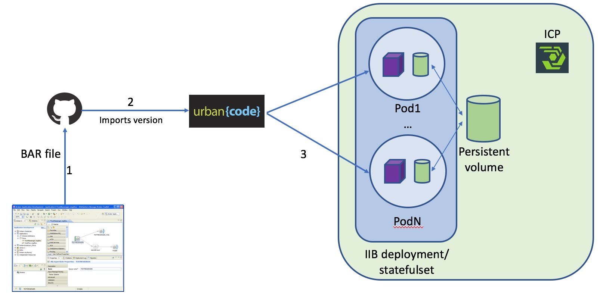
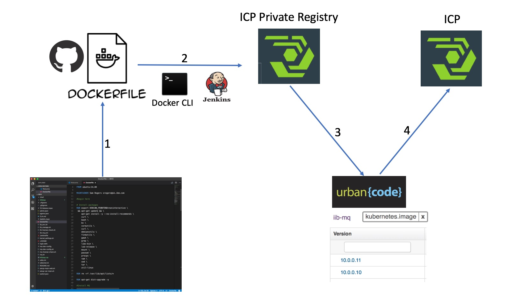
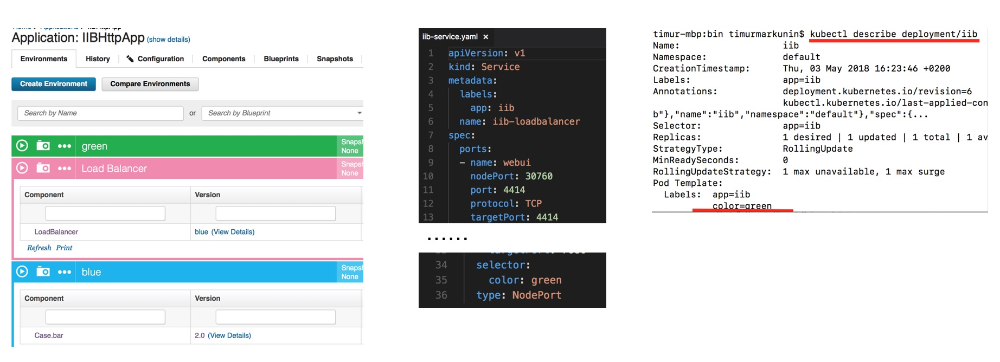

IIB on IBM Cloud Private Demo
=============================

The following scenarios are covered:

1. IIB scaling using UCD
2. IIB auto-scaling and load balancing (stateless case)
3. IIB high-availability (readiness/liveness probes)
4. TODO: MQ integration, TLS
5. IIB Global Cache
6. Custom catalog item (HELM chart)
7. Automated deployment of IIB flows (BAR files) across the cluster
8. IIB version rolling update (using k8s rolling update features)
9. Centralized IIB logging (show centralized IIB logs in Kiabana)
10. Kubernetes cluster and IIB Monitoring
11. (?) Blue/Green deployments, traffic routing, network policies
12. (?) ISTIO - pod-to-pod TLS

## Autoscaling with load balancer

**Scenario**:  
Illustrate how IIB nodes can be automatically scaled for increased performance and resilience based on pre-defined thresholds.

**Benefits:**

- Automated dynamic scaling of IIB based on load
- IIB high-availability due to redundancy and auto-recovery

**Demo tasks**

- Prepare a sample IIB flow (*BAR file*) to respond to GET requests on a REST interface
- Setup IIB stateless scalable *deployment* and load-balancer *service*
- Configure kubernetes auto-scaling policy based on CPU usage
- Simulate increased load to trigger auto-scaling

**Implementation**

Scalable IIB deployment is configured with cluster-wide NFS persistent volume (`/export/BARs`) which holds BARs files. Auto-scaling is set based on CPU threshold (20%). Initial deployment starts one IIB instance and scales to two instances on high load. 

Create auto-scaling policy:

     kubectl autoscale deployment --max=2 --min=1 --cpu-percent=20 iib

The test scenario involves high volume injections of REST GET queries to the service until automatic instance scale-up gets triggered.

HTTP GET single test:

	curl -s -X PUT -i 192.168.24.33:31455/hello -d qwerty

HTTP 'smoke' test using custom script (which runs 100 parallel TCP connections)
    
    ssh master
    ./iib_stress_test.py 192.168.24.33 31455

Monitor pod CPU load
	
	watch -n 1 "kubectl top pod -l app=iib"

Watch pods

    watch -n 1 "kubectl get pods -o wide -l app=iib"

Monitor message stats in iib instances

    kubectl port-forward <iib pod 1> 5000:4414
    kubectl port-forward <iib pod 2> 5001:4414

    and then from browser host:
    ssh -L 5000:localhost:5000 -L 5001:localhost:5001 master
    point browser to http://localhost:5000 and 5001

## IIB scaling using UCD

**Scenario**:  
Illustrate how IIB nodes can be semi-automatically scaled using UCD generic processes

**Benefits:**

- Ability to trigger scalling based on monitoring events through UCD API

**Implementation**

Two UCD generic processes. One for scaling out, another for scaling in. Parameter is used to define element to scale: deployment or statefulset.

Scaling out:

    ss=$(kubectl get ${p:workload.type} | grep 'iib'| awk '{print $1}')
    number=$(kubectl get ${p:workload.type} | grep 'iib'| awk '{print $3}')
    number=$((number+1))
    kubectl scale ${p:workload.type}  $ss --replicas=$number

Scaling in:

    ss=$(kubectl get ${p:workload.type} | grep 'iib'| awk '{print $1}')
    number=$(kubectl get ${p:workload.type} | grep 'iib'| awk '{print $3}')
    number=$((number+1))
    kubectl scale ${p:workload.type}  $ss --replicas=$number

## High availability

**Scenario**  
Constantly watch the IIB node instances and recover from from accidental crashes. Suppress IIB nodes that are running but slow to respond to requests

**Benefits:**

- Increased availability (lower downtime) due to automatic recovery and re-scheduling. Typically useful for low-level failures (HW, resources, network, etc.)
- Visibility and monitoring

**Demo tasks**

- Setup Readiness probe
- Setup Liveness probe
- Simulate failure or unavailability

**Implementation**

IIB high availability is configured using the pod Readiness and Liveness probes which check the IIB HTTP endpoint (exposed on TCP port 7800).

The test case involves blocking the port temporarily on one IIB pod instance and observing how kubernetes a) initially re-routes the incoming traffic and b) later restarts the pod.

Stop IIB node without killing pod

    kubectl exec <iib pod name> -ti -- bash -c "mqsistop IIB_NODE"

Watch pod probe events

    watch "kubectl describe pods <iib pod name> | tail"

Watch pods

    watch "kubectl get pods -o wide -l app=iib"

**Readiness**  
Let’s imagine that your app takes a minute to warm up and start. Your service won’t work until it is up and running, even though the process has started. You will also have issues if you want to scale up this deployment to have multiple copies. A new copy shouldn’t receive traffic until it is fully ready, but by default Kubernetes starts sending it traffic as soon as the process inside the container starts. By using a readiness probe, Kubernetes waits until the app is fully started before it allows the service to send traffic to the new copy.

**Liveness**  
Let’s imagine another scenario where your app has a nasty case of deadlock, causing it to hang indefinitely and stop serving requests. Because the process continues to run, by default Kubernetes thinks that everything is fine and continues to send requests to the broken pod. By using a liveness probe, Kubernetes detects that the app is no longer serving requests and restarts the offending pod.

## MQ Integration

IIB production image doesn't have MQ libraries at the moment. So to demo MQ workflow within IIB container we used development image https://github.com/DAVEXACOM/IIB-MQ.git and connect it to MSB pipeline. In order to deploy another MQ workflow replace/add .bar file to the project.

**Dockerfile modification**
In order to minimize build time move line
	
	COPY *.bar  /etc/mqm/

after following lines

	# Expose default admin port and http port, plus MQ ports
	EXPOSE 4414 7800 7883 1414 9443

	
**Disable MQ security**

You may need to disable MQ authentication in MQ container. 

Connect to mq container
	
	kubectl exec -it mq-ibm-mq-0&nbsp; /bin/bash

Start runmqc
	
	runmqc
	
Disable authentication

	alter qmgr chlauth(disabled)
	dis qmgr all
	alter qmgr connauth(' ‘)
	refresh security

**Setting up SSL**

To use SSL from IIB to a remote QM both IIB and the QM need to exchange certificates stored inside .kdb keystores. The IIB keystore stores its own personal certificate and the remote QM's signer certificate (and vice versa).
To make IIB load up the keystore we run

	mqsichangeproperties IIB_NODE -o BrokerRegistry -n mqKeyRepository -v /path/to/keystore/key

where the absolute path to the key.kdb file is "/path/to/keystore/key.kdb". Also the personal certificate for IIB has to be labeled "ibmwebspheremq<user>" where <user> is the username of the user running the IIB flow engine.

If an MQ node in an IIB message flow has "Use SSL" checked and the appropriate cipherspec set (cipherspec on the node must match the cipherspec on the MQ channel) (in this demo we are using TLS_RSA_WITH_AES_256_CBC_SHA256) and the MQ channel has SSLCAUTH set to REQUIRED the secure connection gets established only if IIB has the QM's extracted certificate in its keystore and vice versa.

To configure the remote QM please consult iib-mq-ssl-notes.txt.

## IIB Global Cache

**Scenario**  
Show IIB embedded global cache feature on IBM Cloud Private container orchestration platform.

**Benefits**

- Use the embedded global cache IIB feature in the same way as on a traditional VM deployment

**Demo tasks**

- Prepare custom IIB image with settings to enable the embedded global cache
- Use scaled IIB *statefulset* with enabled caching
- Use cache policy XML file to define the cache catalog nodes and cache container nodes
- Show cache placement and test function using a custom application (BAR) 

**Implementation:**

Configure multi-integration node cache topology

> To share data across integration nodes, or enhance the availability of the cache, you must create a policy file. The policy file is an XML file that the cache manager uses to connect the caches of multiple integration nodes. Set the cache policy to the fully qualified name of the policy file.

Sample policy files are located here:

    cd /opt/ibm/iib-10.0.0.10/server/sample/globalcache

Customize `policy_two_brokers_ha.xml` by changing FQDN names (`hostname -f`) of the nodes and port ranges.

In k8s, you may create a configmap with e.g. sample 2 brokers policy XML file like this (see more details in the docker image README):

    kubectl create configmap iib-globalcache-policy --from-file=globalcache_policy.xml=policy_two_brokers_ha.xml

Show cache manager properties
    
    kubectl exec -ti iib-0 -- bash -c "mqsireportproperties IIB_NODE -b cachemanager -o CacheManager -r"  

Verify cache placement

    kubectl exec -ti iib-0 -- bash -c "mqsicacheadmin IIB_NODE -c showPlacement"

Deploy custom Global Cache application (src-iib/docker-gc/docker_gc.bar) to test. Test by using HTTP POST with `Content-Type: text/plain` and some data to `<load-balancer-ip>:<load-balancer-http-port>/gchello`. Application increments a counter inside GlobalCache by data length.

    curl 192.168.24.33:31455/gchello -X POST -H "Content-Type: text/plain" -d "data"

## Custom catalog item (HELM chart)

**Scenario**: Leverage IBM Cloud Private's application to catalog to allow users to pick and deploy packaged applications (releases) with convenience of a GUI and central role-based access (RBAC/LDAP).

**Benefits:**

- Make available deployable applications in a GUI catalog
- Options for CI/CD and other ICP tooling

**Demo tasks**

- Show catalog and helm chart creation
- Show Urban Code Deploy integration to create custom Docker image and HELM chart
- Store the image in local ICP Docker registry

**Implementation:**
...

## Automated deployment of IIB flows (BAR files) across the cluster

**Scenario:** Automatic and controlled deployment of IIB flows to the running cluster of IIB nodes.

**Benefits:**

- CI/CD pipeline for BAR deployment -> much faster deployments
- Version control and tracking - control file version sprawl
- Approval flow - process governance

**Tasks:** 

- Configure version control (git) to track IIB application file versions and deploy flows (BAR files) using UCD to the IIB cluster
- UCD pulls new versions from a repo (development folder) and deploys them to the `/export/BARs` global directory
- Backup old files to `BARs backup` directory. - not needed (UCD stores and tracks all deployed versions)

**Implementation:**

UCD copies selected version of component (BAR file) to the mounted volume and then deploys it to all iib pods 

    kubectl get pods | grep 'iib'| awk '{print $1}' | xargs -I {:}  kubectl exec  {:} -- bash -c "mqsideploy   	${p:environment/node.name} -e ${p:environment/server.name} -a ${p:environment/shared.folder}/${p:component.name}"
    
You can verify that desired version of the flow was deployed (Case.bar) by calling

	curl -X PUT -i 'http://192.168.24.33:31277/hello' --data jknjnjk
	
It should return version name in response:

		Hello there!
		You have called the flow "case1" with the following bytes:
		6a6b6e6a6e6a6b
    
    
## IIB version rolling update (using k8s rolling update features)

**Scenario:**: Automatic and controlled update of underlying image for IIB deployments

**Benefits:**

- Version control and tracking - control image version and audit environment inventory
- Approval flow - process governance

**Implementation:**

UCD application contains iib-mq image component which versions are imported from ICP image registry.
Application has deployment process called 'Rolling update'. The process executes

	sfset=$(kubectl get statefulsets | grep 'iib'| awk '{print $1}')
	# kubectl patch statefulset $sfset -p '{"spec":{"updateStrategy":{"type":"RollingUpdate"}}}'
	kubectl patch statefulset $sfset --type='json' -p='[{"op": "replace", "path": 	"/spec/template/spec/containers/0/image", "value":"mycluster.icp:8500/default/${component.name}:${p:version.name}"}]'
	
You can verify image version:

	kubectl describe pod iib-0

Response should contain image version:

	Image:          mycluster.icp:8500/default/iib-mq:10.0.0.10

## Centralized IIB logging

**Scenario:** Out-of-box centralized logging of system and application (IIB) logs

**Benefits:**

- Application log history, search, audit, archive
- Troubleshooting, correlation
- auto-scaling - no manual setup
- possible to integrate with 3rd party tools (e.g. analytics)

**Demo tasks**

- Kibana GUI showcase
- Filter for IIB pod/container logs
- Optional: show custom log collector (/var/log/syslog)

**Implementation**

The container log collection, aggregation and storage are provided by ICP out-of-box through ELK stack.

Redirect IIB logs from `/var/log/syslog` to STDOUT, which is by default collected by Docker log. See [Docker documentation](https://docs.docker.com/config/containers/logging/)

Alternative: Custom application log collector implementation using sidecar container

## Kubernetes cluster and IIB Monitoring

**Scenario:** Built-in metric monitoring of container platform as well as deployed containerized applications

**Benefits:**

- Application performance monitoring and visibility
- Centralized performance metrics collection (Heapster, Prometheus)
- Reporting (Grafana)
- Alerting

**Demo tasks**

- Show Monitoring and Alerting features from GUI
- Create and watch custom metrics using Prometheus expression browser
- Simulate HDD full threshold situation and show alerts in Alertmanager and Slack 

**Implementation**

Launch Prometheus expression browser
    
    kubectl -n kube-system port-forward deployment/monitoring-prometheus 9090:9090
    http://localhost:9090/graph

Configure alerts and external service notifications in configmaps `alert_rules` and `monitoring-prometheus-alertmanager`

Simulate disk full situation by allocating space in a big file

    fallocate -l 30G big-file1.tmp

---

## Blue-green deployment

**Scenario:** Run 2 IIB environments (blue and green) within ICP. At any time, only one of the environments is live, with the live environment serving all production traffic. As you prepare a new version of your software, deployment and the final stage of testing takes place in the environment that is not live. Once you have deployed and fully tested the software in not live environment, you switch the router so all incoming requests now go to it.

**Benefits:**

- Reduce downtime related to the deployment of a new version
- Reduce risks 

**Demo tasks**

- Show deployment.yaml for Green environment
- Show service settings
- Show applicaion environments
- Deploy new version to Blue environment. Show that LoadBalancer still forwarding all trafic to Green environment. Change LB  settings and show that trafic is forwarded to Blue.

**Implementation**

- Change BAR deployment process. Add filtering to pods selected for update:

        kubectl get pods -l color=${p:environment.name} | grep 'iib'| awk '{print $1}' | xargs -I {:}  kubectl exec  {:} -- bash - c "mqsideploy ${p:environment/node.name} -e ${p:environment/server.name} -a  ${p:environment/shared.folder}/${p:component.name}"

- Add new environments for LoadBalancer and Blue environment. 
- Create LoadBalancer as a separate component, import service.yaml as its content (you need 2 verisons: blue and green with diffrent value for selector element). 
- Add LoadBalancer deployment process:

        kubectl delete service iib-loadbalancer
        kubectl apply -f ./*.yaml
      
  

## Links
IIB chart repo:  
[https://github.com/ot4i/iib-helm]()

IIB docker repo:  
[https://github.com/ot4i/iib-docker]()  
[https://github.com/DAVEXACOM/IIB-MQ.git]()

Setting up the MSB pipeline:  
[https://www.ibm.com/support/knowledgecenter/en/SS5PWC/pipeline.html]()  
[https://developer.ibm.com/integration/blog/2017/09/18/lightweight-integration-useful-links/]()

Setting up health checks with readiness and liveness probes  
[https://cloudplatform.googleblog.com/2018/05/Kubernetes-best-practices-Setting-up-health-checks-with-readiness-and-liveness-probes.html]()  
